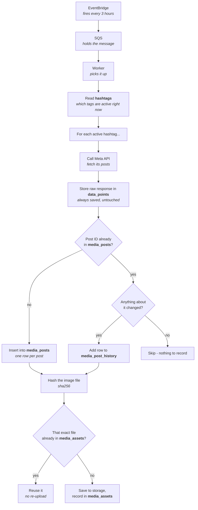

# Diagrams

Two pictures: how a sync happens, and what every table stores.

---

## 1. The flow

The worker never hardcodes `matcha` — it reads `hashtags` first and loops over
whatever is active, which is why tracking a new tag is a database row rather than a
code change. Two separate dedupe checks happen here: **the post** is deduped by its
Instagram ID (in `media_posts`), and **the file** is deduped separately by the hash
of its bytes (in `media_assets`) — two different posts can share the same
underlying image, and reposts on a busy tag like `matcha` are common enough that
this matters.

---

## 2. All six tables, at a glance

| Table | Stores | Written |
| --- | --- | --- |
| **`hashtags`** | which hashtags to track (matcha) | once per hashtag |
| **`sync_runs`** | one row per sync attempt — counts, status, errors | once per sync |
| **`data_points`** | the raw response from Meta, untouched | every item, every sync |
| **`media_posts`** | one row per unique post — caption, likes, permalink | once per post, updated after |
| **`media_post_history`** | a copy of the post, saved only when something changed | only on change |
| **`media_assets`** | where the downloaded file lives, and its hash | once per post's file |

---

## 3. Every field, table by table

<code>hashtags</code> — which hashtags to track, and when

| Field | Type | Note |
| --- | --- | --- |
| `id` | uuid | primary key |
| `name` | text | e.g. "matcha" — unique |
| `ig_hashtag_id` | text | Meta's ID for this tag, cached |
| `ig_hashtag_id_resolved_at` | timestamp | when it was cached |
| `is_active` | boolean | still being synced? |
| `track_from` | timestamp | optional start of tracking window |
| `track_until` | timestamp | optional end of tracking window |
| `top_sync_enabled` | boolean | sync top_media for this tag? |
| `recent_sync_enabled` | boolean | sync recent_media for this tag? |
| `max_media_per_sync` | integer | override of the global cap |
| `last_top_synced_at` | timestamp | last successful top sync |
| `last_recent_synced_at` | timestamp | last successful recent sync |
| `last_sync_error` | text | most recent failure message |
| `consecutive_failures` | integer | how many syncs in a row failed |
| `notes` | text | free-text notes |
| `created_at` / `updated_at` | timestamp | row bookkeeping |

<code>sync_runs</code> — one row per sync attempt

| Field | Type | Note |
| --- | --- | --- |
| `id` | uuid | primary key |
| `hashtag_id` | uuid | which hashtag this run was for |
| `type` | enum | `top_media` or `recent_media` |
| `status` | enum | running / succeeded / partial / failed |
| `triggered_by_message_id` | text | the SQS message that started it |
| `started_at` / `finished_at` | timestamp | when it ran |
| `duration_ms` | integer | how long it took |
| `pages_fetched` | integer | pages pulled from Meta |
| `items_seen` | integer | posts Meta returned |
| `items_new` | integer | posts never seen before — the dedupe number |
| `items_updated` | integer | existing posts whose content changed |
| `metrics_recorded` | integer | history rows actually written |
| `asset_jobs_enqueued` | integer | downloads queued this run |
| `hit_item_cap` | integer | did it stop early at the cap? |
| `rate_limit_snapshot` | jsonb | Meta's rate-limit headers at the end |
| `last_cursor` | text | pagination bookmark, for resuming |
| `attempts` | integer | how many times this run was retried |
| `error` | text | failure message, if any |
| `created_at` | timestamp | row bookkeeping |

<code>data_points</code> — the raw Meta response, untouched

| Field | Type | Note |
| --- | --- | --- |
| `id` | uuid | primary key |
| `sync_run_id` | uuid | which sync produced this |
| `hashtag_id` | uuid | which hashtag |
| `ig_media_id` | text | the post's Instagram ID |
| `source` | enum | top or recent |
| `page_number` | integer | which page of results |
| `position_in_page` | integer | position within that page |
| `position_overall` | integer | position across the whole sync |
| `payload` | jsonb | the exact object Meta returned |
| `fetched_at` | timestamp | when it was fetched |

<code>media_posts</code> — one row per unique post

| Field | Type | Note |
| --- | --- | --- |
| `id` | uuid | primary key |
| `ig_media_id` | text | unique — this is the dedupe key |
| `hashtag_id` | uuid | which hashtag it belongs to |
| `media_type` | enum | image / video / carousel |
| `caption` | text | the post's caption |
| `permalink` | text | link to the post — never expires |
| `source_media_url` | text | Meta's signed image URL — **does** expire |
| `caption_hashtags` | text[] | #tags pulled from the caption |
| `caption_mentions` | text[] | @mentions pulled from the caption |
| `taken_at` | timestamp | when it was posted on Instagram |
| `first_seen_at` | timestamp | when we first found it |
| `last_seen_at` | timestamp | when we last saw it again |
| `content_updated_at` | timestamp | when caption/type/link actually changed |
| `like_count` | integer | likes, right now |
| `comments_count` | integer | comments, right now |
| `metrics_updated_at` | timestamp | when likes/comments last refreshed |
| `seen_in_top` / `seen_in_recent` | boolean | which lists it has appeared in |
| `best_top_rank` | integer | best position ever in top_media |
| `is_stale` | boolean | stopped appearing — maybe deleted |
| `created_at` / `updated_at` | timestamp | row bookkeeping |

<code>media_post_history</code> — a copy of the post, saved only when it changed

| Field | Type | Note |
| --- | --- | --- |
| `id` | uuid | primary key |
| `media_id` | uuid | which post this snapshot belongs to |
| `hashtag_id` | uuid | which hashtag |
| `sync_run_id` | uuid | which sync captured this |
| `ig_media_id` | text | the post's Instagram ID |
| `caption` | text | caption at that moment |
| `permalink` | text | permalink at that moment |
| `caption_hashtags` / `caption_mentions` | text[] | tags at that moment |
| `like_count` | integer | likes at that moment |
| `comments_count` | integer | comments at that moment |
| `rank` | integer | position in top_media that run |
| `changed_fields` | text[] | which fields moved — why this row exists |
| `captured_at` | timestamp | when this snapshot was taken |

<code>media_assets</code> — the downloaded file, and its hash

| Field | Type | Note |
| --- | --- | --- |
| `id` | uuid | primary key |
| `media_id` | uuid | which post this file belongs to |
| `status` | enum | pending / downloading / stored / failed / skipped |
| `sha256` | text | hash of the file's bytes — the dedupe key |
| `storage_key` | text | where it lives, e.g. `media/0e/a1/...jpg` |
| `storage_provider` | text | "local" or "s3" |
| `content_type` | text | image/jpeg, video/mp4, etc. |
| `size_bytes` | bigint | file size |
| `fetched_from_url` | text | the (now-expired) Meta URL it came from |
| `attempts` | integer | download retry count |
| `last_error` | text | why the last attempt failed, if it did |
| `download_started_at` / `stored_at` | timestamp | when download began / finished |
| `created_at` / `updated_at` | timestamp | row bookkeeping |

